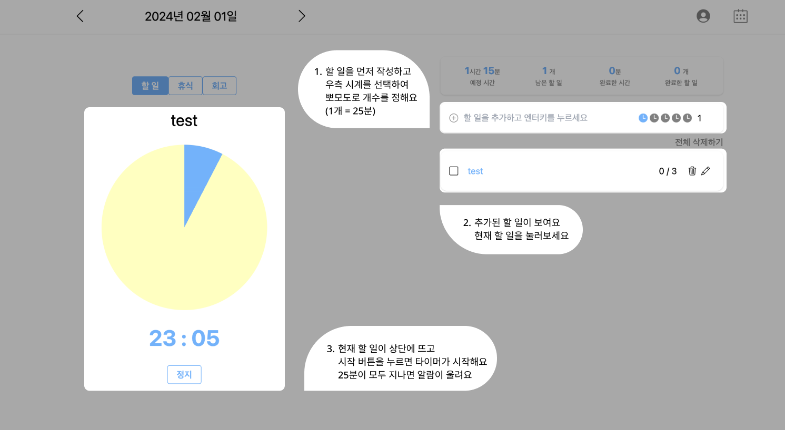

# taskgrow

💡 Taskgrow는 집중력 향상을 위한 <b>할 일 체크리스트</b>와 함께 동작하는 <b>뽀모도로 타이머</b>를 통한 개인 생산성 관리 서비스입니다.

🎯 뽀모도로 기법 - 타이머를 활용해서 25분간 집중해서 일하고, 5분간 휴식하는 기법

✨ **서비스** : [http://taskgrow.codesoom.com](http://taskgrow.codesoom.com/)

테스트 계정으로 로그인 시
|ID|PASSWORD|
|--|--|
|sample|1234|

## 🤔 Taskgrow? 그거 그냥 평범한 체크리스트 아니야? 뭐가 달라?

Taskgrow은 더 나은 일상 관리를 위한 서비스로, 뽀모도로와 할 일 체크리스트를 통한 할 일 관리를 넘어 **사용자의 감정에 중심을 두는 독특한 기능**을 제공합니다. 할 일을 완료하고 회고 작성 시, 사용자의 기분에 따라 달력에 자동으로 감정 기록 스티커가 표시됩니다.

이 감정 기록 스티커를 통해 사용자는 **자신의 감정 패턴을 시각적으로 파악**하고, 특정 기분이 발생한 원인을 알 수 있습니다. 달력에 스티커가 채워짐에 따라 성취감을 느끼고, 아직 완료하지 못한 일에 대해 회고 기능을 활용하여 개선 방안을 고민할 수 있습니다. 이를 통해 사용자는 **지속적인 목표 달성에 동기부여**를 받게 됩니다.

**회고 기능**은 하루 동안의 성과와 개선 가능한 부분을 돌아보고 분석함으로써, 사용자가 더 나은 방향으로 성장할 수 있도록 돕습니다. Taskgrow는 사용자의 일상을 더 풍요롭고 의미있게 만들어주는 동시에, 개인의 감정과 목표 달성을 조화롭게 이끌어내는 서비스입니다.

## 프로젝트 기획 배경

사람들이 효과적으로 일상을 관리하고, 집중력을 높이며, 감정을 기록하고 이해하는 서비스가 필요하다.

-   집중력 향상 : 뽀모도로 기법(25분의 집중 시간과 5분의 휴식 시간)을 활용하여 작업 효율과 집중력을 높이는 요구가 있다.
-   감정의 이해 : 일상 속에서 자신의 감정 패턴을 파악하고, 특정 감정이 발생한 원인을 이해하고자 하는 욕구가 있다.
-   성취감 제공 : 자신의 작업을 완료하고 그 결과를 명확히 확인함으로써 성취감을 느끼고 싶다.
-   자기 개선 : 더 나은 방향으로 성장하고 싶은 욕구가 있다.

## 기능

### 첫 화면 (온보딩 페이지)

-   사용자가 어려움 없이 이용할 수 있도록 웹 페이지 처음 접속 시 온보딩 페이지가 보임
-   로그인 기록이 있다면 로그인 화면이 보이도록 함
<table>
  <tr>
    <td></td>
    <td></td>
  </tr>
  <tr>
    <td>로그인 기록 X</td>
    <td>로그인 기록 O</td>
  </tr>
</table>

### 달력

-   해당 날짜의 남은 할 일 수가 표시됨
    -   작성된 할 일을 모두 끝냈을 경우
        -   회고 작성 O : 기분에 따라 달력에 감정 기록 스티커 표시
        -   회고 작성 X : DONE 스티커 표시
-   마우스 커서를 올리면 남은 할 일의 상세 내용(할 일, 타이머 개수)이 표시됨 (최대 3개)
<table>
  <tr>
    <td></td>
    <td></td>
  </tr>
  <tr>
    <td>기본 달력 페이지</td>
    <td>특정 날짜에 마우스 커서 올릴 시</td>
  </tr>
</table>

### 할 일 페이지

-   해당 날짜의 할 일 리스트와 타이머가 보이는 페이지
-   회원은 우측 상단에 마이페이지, 달력 페이지로 갈 수 있는 버튼 존재
-   비회원은 로그인과 회원가입을 할 수 있는 버튼 존재
    -   할 일 추가, 수정, 삭제, 완료 표시, 타이머, 휴식만 이용 가능
    -   할 일 페이지의 날짜 변경, 달력, 회고 이용 불가능
-   할 일을 추가하거나 완료에 따라 예정 시간, 남은 할 일, 완료한 시간, 완료한 할 일이 보여짐
<table>
  <tr>
    <td></td>
    <td></td>
  </tr>
  <tr>
    <td>회원</td>
    <td>비회원</td>
  </tr>
</table>

-   비회원 로그인, 회원가입 클릭 시 modal창 보여짐

<table>
  <tr>
    <td></td>
    <td></td>
  </tr>
  <tr>
    <td>비회원 로그인 클릭 시</td>
    <td>비회원 회원가입 클릭 시</td>
  </tr>
</table>

### 할 일 추가

-   할 일과 타이머 개수 설정 가능
-   등록된 할 일이 없을 경우 "오늘 할 일 추가해주세요" 문구가 보임
    -   있을 경우 "오늘 할 일 골라주세요" 문구가 보임
-   타이머 개수는 기본 1개(25분)로 설정되어 있음
-   할 일 입력 후 엔터 or +버튼 클릭 시 할 일 추가됨
-   공백을 추가할 수 없음
-   타이머는 타이머 모양 버튼을 클릭하거나 5개 이상부터는 직접 개수를 입력하여 추가할 수 있음

<table>
  <tr>
    <td></td>
    <td></td>
  </tr>
  <tr>
    <td>등록된 할 일이 없을 시</td>
    <td>등록된 할 일이 있을 경우</td>
  </tr>
</table>

### 할 일 시작

-   할 일 클릭 시 해당 할 일이 모양과 색상으로 표시됨
    -   좌측에 어떤 할 일에 대한 타이머인지 상단에 나타남
-   타이머는 기본 25분으로 설정
-   시간이 지날수록 파란색으로 채워짐
<table>
  <tr>
    <td></td>
    <td></td>
  </tr>
  <tr>
    <td>할 일 선택</td>
    <td>해당 할 일 시작</td>
  </tr>
</table>

### 할 일 진행 중

-   타이머 진행 중에 다른 버튼(휴식, 회고, 달력, 마이페이지)을 누를 시 안내창 띄움
-   타이머가 진행 중이라면 favicon과 title로 시간이 얼마나 남았는지 확인 가능

<table>
  <tr>
    <td></td>
    <td></td>
  </tr>
  <tr>
    <td>타이머 진행 중에 휴식 버튼을 클릭 시</td>
    <td>favicon과 title로 현재 진행 중인 타이머 시간 보여짐</td>
  </tr>
</table>

### 할 일 끝남

-   해당 할 일의 타이머 25분이 모두 지났다면 소리 알람과 안내창 띄움
-   할 일이 끝나면 바로 휴식 타이머(5분)로 전환
-   할 일을 1번이라도 완료했다면 완료 체크 표시 가능
    -   계획된 타이머의 개수를 채우지 않아도 됨 (넘기기도 가능)
    -   완료된 할 일은 아래로 내려감
    <table>
      <tr>
        <td></td>
        <td></td>
      </tr>
      <tr>
        <td>타이머 진행 중에 휴식 버튼을 클릭 시</td>
        <td>favicon과 title로 현재 진행 중인 타이머 시간 보여짐</td>
      </tr>
    </table>

### 회고

-   오늘 하루에 대한 기분과 회고 작성 기능
-   기분은 1 ~ 10까지 마우스로 클릭하여 설정 가능
    -   기분에 따라 달력에 감정 스티커 표시
-   작성된 회고는 수정, 삭제 가능

<table>
  <tr>
    <td></td>
    <td></td>
  </tr>
  <tr>
    <td>회고 작성 전</td>
    <td>회고 작성 후</td>
  </tr>
</table>

### 마이페이지

-   한 달간의 사용자의 할 일과 감정 기록 통계 확인 가능
-   할 일 달성률을 보여주고, 달성률에 따른 응원 메시지 표시
-   기분 통계를 그래프로 표시하여 한 달간의 감정 확인 가능
-   한 일의 완료, 진행중, 미완료 / 감정의 각 그래프 클릭 시 해당하는 상세 내역 확인 가능

<table>
  <tr>
    <td></td>
    <td></td>
  </tr>
  <tr>
    <td>기본 마이페이지</td>
    <td>클릭 시 상세 내역 확인 가능</td>
  </tr>
</table>

-   내용을 클릭하면 해당하는 날짜의 할 일 페이지로 이동

### 👤 타켓 유저

-   시간을 효과적으로 관리하고 싶은 누구나
-   작업의 효율성을 따지는 사람
-   집중력을 향상시키고자 하는 사람

### 💘 기대 효과

1. 할 일 효과적으로 관리 (유저는 달력 및 투두 화면을 통해 시각적으로 파악하고 관리할 수 있습니다)

2. 뽀모도로 기법을 활용한 집중 향상

3. 일상 회고를 통한 감정 회고 (회고 기능을 통해 오늘의 감정을 기록하고 회고 작성을 통해 성취감을 느낄 수 있습니다)

4. 미완료 작업 강조 및 완료 도장 유도 (미완료된 할 일은 숫자로 남음으로써 유저가 미루지 않고 작업을 완료할 수 있도록 독려하고 완료된 작업에는 감정에 따른 여러 도장을 통해 성취감을 얻을 수 있습니다)

5. 데이터 시각화를 통한 파악 (달력 화면에 해당 달의 감정의 변화와 성과 여부를 알 수 있습니다)

## 개발 환경

### 프론트

 Zustand

### 백엔드

